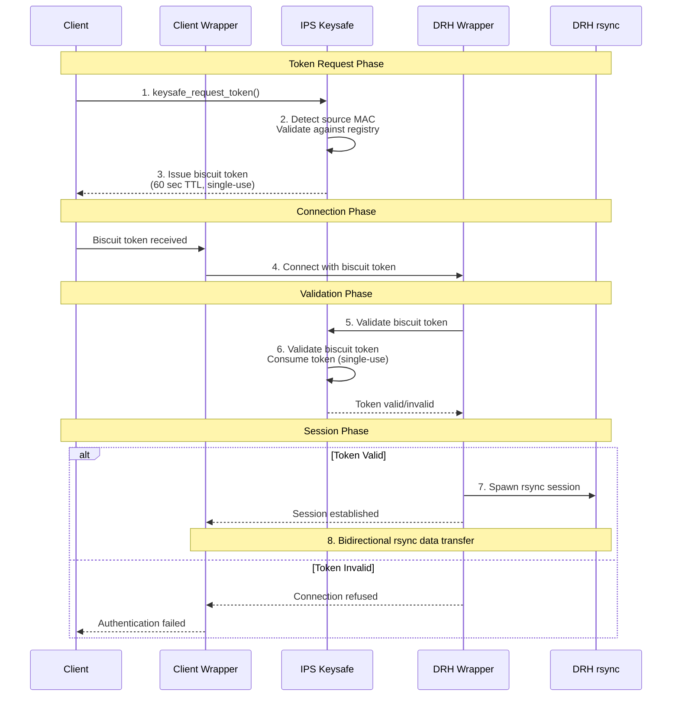

# Keysafe Token Authentication Flow

## Overview

The HPS keysafe system implements a secure, token-based authentication mechanism for establishing rsync sessions between cluster nodes and disaster recovery hosts (DRH). This flow ensures that only authorized nodes can initiate data replication by requiring them to first obtain a cryptographic biscuit token from the Initial Provisioning System (IPS). The IPS validates the requesting node's MAC address against its registry before issuing a time-limited, single-use biscuit token that expires after 60 seconds. This token is then presented to the DRH wrapper, which validates it with the IPS keysafe service before spawning the actual rsync session, creating a secure chain of trust that prevents unauthorized access while enabling efficient data synchronization across the HPS infrastructure.

## Flow Diagram

## Key Security Features

1. **Biscuit Token Format**: Uses cryptographic biscuit tokens for secure authorization
2. **MAC Address Validation**: IPS validates the source MAC against a pre-registered registry
3. **Time-Limited Tokens**: Biscuit tokens expire after 60 seconds
4. **Single-Use Tokens**: Each token can only be used once (consumed on validation)
5. **Centralized Validation**: All token validation goes through IPS keysafe

## Implementation Notes

- The Client Wrapper and DRH Wrapper handle the secure token exchange
- The actual data transfer happens via rsync after authentication
- Token consumption prevents replay attacks
- Short TTL (60 seconds) limits exposure window
